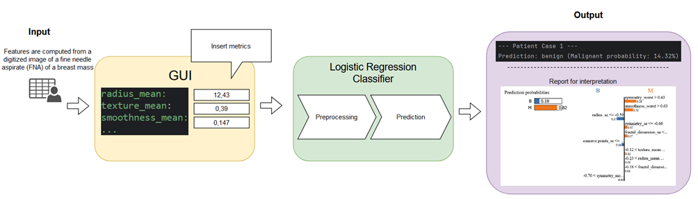

# Deployment Phase

**Goal:**  
In the deployment phase, we integrate the selected, finalized model into a usable form so that it can be applied to 
new, real-world data. This involves preparing scripts and resources for prediction requests, model explanations, and 
building trust with end-users (e.g., doctors).

**Key Steps & Highlights:**
1. **Model Loading & Integration:**
   - Loaded the finalized logistic regression pipeline (`lr_pipeline.pkl`) that was selected from the modeling phase.
   - Ensured that the necessary reference data (`X_train_reference.csv`) is available to support interpretability 
   tools like LIME.

2. **Predicting on New Data:**
   - A new input dataset (`new_patient_data_*.csv`) is used as a sample case to simulate real incoming data.
   - The pipeline preprocesses the input data, applies the trained logistic regression model, and outputs the 
   predicted probability and class (malignant or benign).

3. **Model Interpretability & Explanations:**
   - LIME (Local Interpretable Model-Agnostic Explanations) is applied to explain individual predictions, 
   helping end-users understand why the model made a certain decision.
   - Feature contributions are highlighted in different colors (e.g., green for features that increase 
   malignant probability, red for those that decrease it).
   - A warning message is displayed if the input values fall into a known "critical range," informing doctors 
   that careful manual review may be needed.

4. **Artifact Generation & Delivery:**
   - LIME explanations are saved as HTML files (`lime_explanation_case_*.html`) for easy sharing and review.
   - This can be integrated into a broader clinical decision support system, where doctors can upload 
   new patient data and immediately receive predictions and explanations.

5. **User Guidance & Trust Building:**
   - By providing interpretable results and highlighting critical cases, we increase the trust and confidence 
   of medical professionals in the model’s predictions.
   - The final deployment script demonstrates end-to-end usage, from input CSV to interpretable results, 
   enabling seamless integration into daily workflows.

---

**Data Flow Visualization:**

**Explanation:**
- **Input (CSV):** A new patient’s measurement data is provided in a `.csv` file.
- **Model Pipeline:** The logistic regression model pipeline preprocesses the input features (scaling, encoding) 
and runs the prediction to classify the tissue as malignant or benign.
- **Interpretation:** LIME (and potentially SHAP) is applied to the prediction to generate a 
human-readable explanation, showing which features influenced the decision the most.
- **Artifacts:** The explanations and warning messages are saved as artifacts (HTML files, images) 
that medical staff can easily review.

