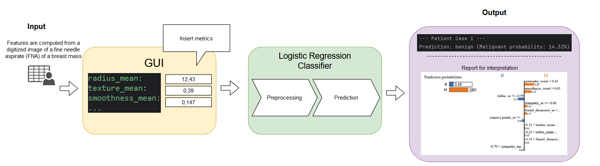

# Exit Report for Customer Acceptance

## Project Overview

**Project Title:** Interpretable Breast Cancer Classification Model

This exit report summarizes the entire project executed following the Team Data Science Process (TDSP). 
It outlines the initial goals, the methodologies used, key findings, and the lessons learned. It also provides 
recommended next steps and documentation transfer details to ensure a smooth operational handoff.

## Business Goal and Motivation

The primary objective of this project was to develop an accurate and interpretable machine learning model to 
classify breast tumors as benign or malignant. The motivation stemmed from the need for a fast, reliable, 
and explainable solution to support oncologists’ diagnostic decisions, ultimately leading to better patient 
outcomes and increased trust in automated decision-support tools.

## Process Followed (TDSP)

This project was structured according to the Team Data Science Process (TDSP), ensuring a standardized 
approach to data science projects. The key phases were:

1. **Business Understanding**:  
   - Defined the problem scope and success criteria in alignment with medical experts and stakeholders.
   - Established performance targets (e.g., F1 score > 0.95) and interpretability requirements.
   
2. **Data Acquisition and Understanding**:  
   - Gathered and examined the provided breast cancer dataset.
   - Conducted exploratory data analysis (EDA), data cleaning, feature selection, and transformation.
   - Identified key data quality issues and their impact on modeling.

3. **Modeling**:  
   - Evaluated multiple models including Logistic Regression, Random Forest, Gradient Boosting, and Explainable 
   Boosting Machine (EBM).
   - Performed hyperparameter tuning and model selection to achieve both high accuracy and interpretability.
   - Achieved final model performance exceeding the pre-defined metric thresholds (e.g., ~0.96 Accuracy, ~0.95 F1 Score).

4. **Deployment**:  
   - Developed a pipeline for model inference, ensuring reproducibility and consistency.
   - Created reference documentation for integrating the model into the existing clinical decision support system.

5. **Customer Acceptance (This Phase)**:
   - Demonstrated model interpretability using global and local explanation methods (PDPs, LIME, SHAP).
   - Conducted a user acceptance testing session with oncologists and medical staff to ensure usability and trust 
   in the model outputs.

## Key Results and Findings

- **High Predictive Performance**:  
  The chosen Logistic Regression model surpassed the target F1-score of 0.95, confirming its reliability in classifying tumors.

- **Interpretability Achieved**:  
  The model provided clear explanations at both global (feature importances, partial dependence plots) and local
(individual predictions) levels. This improved clinical trust.

- **Error Analysis and Insights**:  
  Through misclassification analysis, we identified feature thresholds and cases that are challenging. 
Oncologists can use these insights to guide additional tests.

- **Data Quality Insights**:  
  The analysis shed light on the importance of consistent, high-quality data. Regular updates and expansions 
of the dataset will further improve model performance and robustness.

## Documentation

- **Model Artifacts and Code**:  
  The final code, model artifacts, and pipeline scripts are stored in the project’s version-controlled repository. 
Detailed README files explain how to run, evaluate, and maintain the model.

## Final steps

By delivering an accurate, interpretable, and well-documented predictive model, we have met the project’s objectives.

